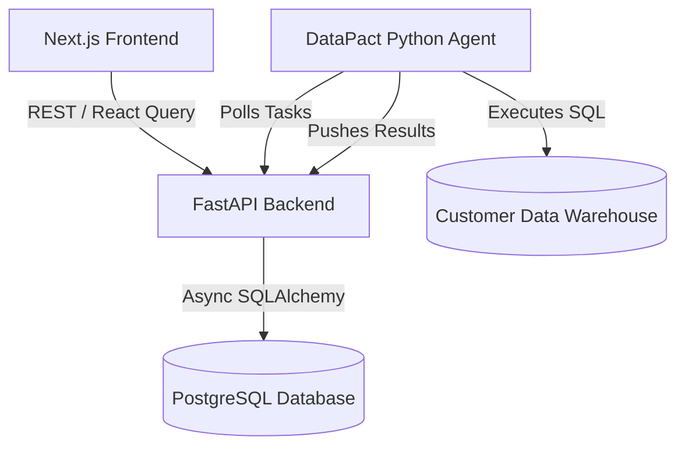

# DataPact Frontend Dashboard

The frontend of **DataPact** is the central control plane for data engineering teams. It visualizes data contracts, monitors SLA compliance, and alerts users to data quality violations across all configured data sources.

## 🏗 Architecture & Stack

- **Framework:** [Next.js](https://nextjs.org/) using the App Router (`src/app/`).
- **Language:** TypeScript for robust, type-safe components.
- **Styling:** [Tailwind CSS](https://tailwindcss.com/) for fast, responsive, and modern UI design.
- **Layout:** A responsive dashboard layout featuring a navigation sidebar and centralized data views for Contracts, Validations, Violations, and SLAs.

## 🔌 Connecting to the Backend

This frontend acts as the visual presentation layer and communicates with the **DataPact FastAPI Backend**. 
By default, the Next.js application will attempt to fetch data from `http://localhost:8000/api/v1` (where the backend runs). Ensure that you have followed the startup instructions in `backend/README.md` to have the API serving data before expecting the dashboard to populate.

## 🚀 Getting Started

### 1. Prerequisites
- **Node.js** (v18 or newer)
- **npm** (comes with Node)

### 2. Install Dependencies
Navigate into the `frontend` directory and install the required Node modules:

```bash
cd frontend
npm install
```

### 3. Run the Development Server
Start the Next.js development server:

```bash
npm run dev
```

### 4. View the Dashboard
Open your browser and navigate to:
[http://localhost:3000](http://localhost:3000)

You will see the main overview dashboard. Use the sidebar to navigate between the Contracts Registry, Validation logs, and SLA scores.


# DataPact Project Walkthrough

DataPact is a modern, full-stack Data Reliability & Quality Platform designed to monitor data assets, enforce data quality contracts, visualize data lineage, and auto-triage incidents. 

This document serves as a complete walkthrough of the project's architecture, technology stack, and core workflows across the frontend, backend, and agent execution layers.

---

## 🏗️ Architecture Overview

The DataPact ecosystem consists of three primary components:

1. **Frontend (Control Plane UI)**: A Next.js web application where users configure contracts, view incidents, explore asset catalogs, and monitor platform health.
2. **Backend (Control Plane API)**: A FastAPI service backed by PostgreSQL that handles metadata storage, authentication, API endpoints, and orchestration.
3. **DataPact Agent (Data Plane Execution)**: A lightweight Python agent that sits inside the customer's infrastructure. It polls the backend for validation tasks, executes queries directly against data warehouses (e.g., Snowflake, PostgreSQL), and returns aggregated results (never raw data) back to the backend.



---

## 🖥️ Frontend Walkthrough

**Tech Stack**: Next.js 14 (App Router), React, TypeScript, Tailwind CSS, React Query, Recharts, Lucide Icons.

The frontend is built for speed and aesthetics, utilizing standard modern React patterns.

### Key Pages & Features:
- **Dashboard (`/page.tsx`)**: The central hub. Displays high-level metrics (Total Assets, Active Contracts, Open Incidents), a trend chart of validation runs, and a live queue of recent incidents.
- **Contracts Registry (`/contracts`)**: Lists all defined data quality contracts. Includes a **New Contract (`/contracts/new`)** page where users can define rules (e.g., Not Null, Unique, Freshness SLAs) for specific tables.
- **Incidents Queue (`/incidents`)**: The triage center. Displays all `FAILED` validation runs as tracked incidents. Users can view assigned runbooks, severity, and status.
- **Asset Catalog (`/dbt/catalog`)**: A unified view of all discovered data assets (tables, dbt models, sources). Shows health scores and whether an asset is protected by a contract.
- **Asset 360 (`/assets/[id]`)**: A deep-dive page for a specific asset. Includes tabs for Ownership, Lineage reach, Incident History, GitHub PR impact, and an AI Copilot root-cause analysis summary.

### Data Fetching (React Query)
The entire frontend is bound to the backend using `@tanstack/react-query` and a custom `apiClient.ts` wrapper. This ensures:
- Seamless JWT token injection on every request.
- Automatic caching and background refetching.
- Graceful redirection to `/auth/login` on 401 Unauthorized errors.

---

## ⚙️ Backend Walkthrough

**Tech Stack**: Python, FastAPI, SQLAlchemy (Asyncpg), PostgreSQL, Pydantic, Passlib (JWT).

The backend is entirely asynchronous, built to handle massive scale for enterprise metadata ingestion.

### Core Modules:
- **Authentication (`/auth`, `/provisioning`)**: Manages Workspaces, Organizations, and Users. Handles JWT generation and verification.
- **Contracts (`/contracts`)**: CRUD operations for data quality rules. When a contract is saved, it is queued for execution.
- **Agent Orchestration (`/agent/tasks`, `/agent/results`)**: The critical loop.
  - `GET /agent/tasks`: The backend looks up active contracts and dispenses them as execution tasks to authenticated agents.
  - `POST /agent/results`: The backend ingests the validation results. If a result `status` is `FAILED`, the backend automatically generates an `Incident`.
- **Incidents & Runbooks (`/incidents`, `/runbooks`)**: Maps failures to specific runbooks and teams for rapid triage.
- **Metadata Discovery (`/dbt`)**: Ingests `manifest.json` files from dbt projects to populate the asset catalog, mapping dependencies and test coverage.

### Database Schema (SQLAlchemy)
The PostgreSQL database is highly normalized to support multi-tenancy:
- **Base**: `Organization`, `Workspace`, `User`.
- **Core**: `DataSources`, `AssetOwner`, `Team`, `Contract`, `ValidationRun`, `Incident`, `Runbook`.
- **Integrations**: `DbtModel`, `DbtSource`, `GithubPullRequest`, `AirflowFailure`, `LineageNode`.

---

## 🔄 End-to-End Workflow: The Lifecycle of a DataPact Contract

To truly understand how the project works, here is the lifecycle of a single data quality check:

1. **User Creates a Contract (Frontend)**
   - The user navigates to `/contracts/new` and creates a `not_null` rule on the `order_id` column in the `orders` table.
   - The frontend sends a `POST /api/v1/contracts` request. The backend saves this in the PostgreSQL `contracts` table.

2. **Agent Polls for Work (Agent)**
   - The lightweight Python agent (running on a cron job or daemon) hits `GET /api/v1/agent/tasks`.
   - The backend responds with the new contract task: `{"rule": "not_null", "table": "orders", "column": "order_id"}`.

3. **Validation Execution (Agent)**
   - The Agent connects to the target Data Warehouse (e.g., Snowflake or local Postgres) using secure, local credentials.
   - It executes: `SELECT COUNT(*) FROM orders WHERE order_id IS NULL;`
   - It discovers 1 null record.

4. **Result Submission (Agent -> Backend)**
   - The Agent sends a payload to `POST /api/v1/agent/results` indicating `status: "FAILED"` with an `actual_value: 1`.

5. **Incident Generation (Backend)**
   - The backend receives the failure. It logs a `ValidationRun`.
   - Because it failed, it queries the `AssetOwner` table. It finds the "Data Platform" team owns the `orders` table.
   - It creates an `Incident` in the database assigned to that team, with a "HIGH" severity.

6. **Triage & Resolution (Frontend)**
   - The user opens the frontend Dashboard. The new incident appears instantly in the queue.
   - They click the incident, opening the **Incident Detail** panel (`/incidents/page.tsx`), which links them to the matching **Runbook** for immediate resolution.

---

## 🚀 Current Status & Next Steps

The platform's control plane (UI + API) and the foundational execution pipeline are **100% complete and verified**. The React UI is successfully bound to real PostgreSQL data via the FastAPI endpoints.

**Upcoming Horizons (Phase 2.8 & Beyond):**
- **AI Auto-Remediation**: Agents that don't just report failures, but suggest or execute SQL to fix data pipelines automatically.
- **GitHub PR Integration**: Blocking code merges if they violate downstream data contracts.
- **Dynamic Lineage Graphs**: Fully interactive DAG visualizations for asset dependencies.
